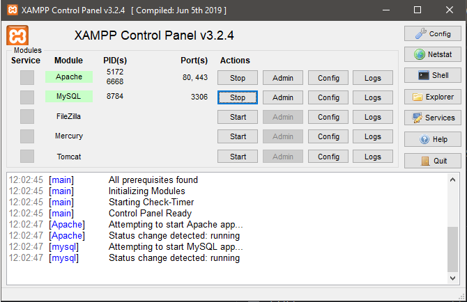
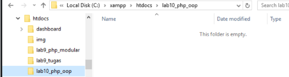
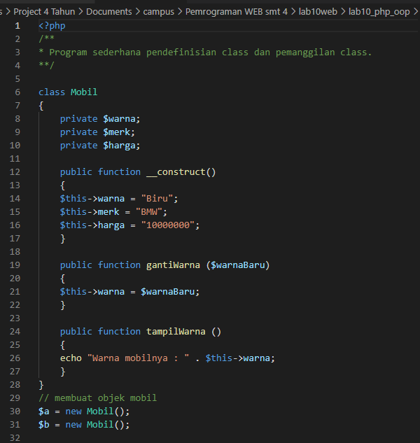
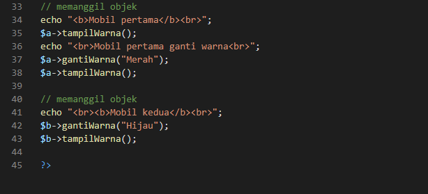
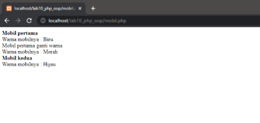
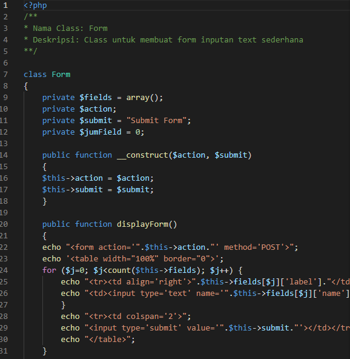
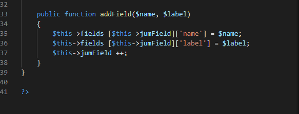
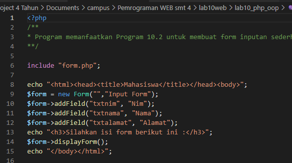
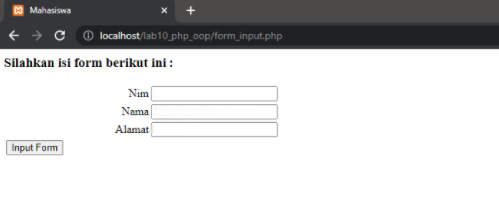

# Lab10Web
### PHP OOP
#### 1. Buka XAMPP lalu jalakan Apache dan MySQL

#### 2. Buat file lab10_php_oop pada root directory web server c:\xampp\htdocs

#### 3. Buat file baru dengan nama mobil.php pada folder c:\xampp\htdocs\lab10_php_oop

Coding PHP OOP sederhana, membuat Class dan memanggil Class

Hasil Ketika di buka menggunakan link di sammping http://localhost/lab10_php_oop

#### 4. Buat file baru dengan nama form.php pada folder c:\xampp\htdocs\lab10_php_oop

Coding form.php ini untuk Class

#### 5. Buat file baru dengan nama form_input.php pada folder c:\xampp\htdocs\lab10_php_oop

Coding form_input.php ini untuk memanggil Class yg sudah dibuat tadi.

Hasil Ketika di buka menggunakan link di sammping http://localhost/lab10_php_oop/form_input.php

